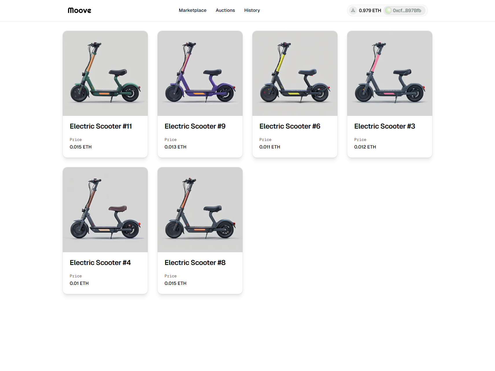

# StartToImpact: Progetto Finale Blockchain

[](LICENSE)
[](https://hardhat.org)
[](https://ethereum.org/)

<div align="center">
    
</div>

## Descrizione

Moove Marketplace è una piattaforma decentralizzata basata su blockchain Ethereum che permette l'acquisto, la vendita e la gestione di NFT legati alla mobilità condivisa. Il progetto implementa un marketplace completo dove gli utenti possono acquistare NFT a prezzo fisso o partecipare ad aste per aggiudicarsi token unici.

La piattaforma utilizza smart contract sviluppati in Solidity che seguono lo standard ERC-721. I metadati degli NFT sono archiviati su IPFS per garantire decentralizzazione e persistenza delle informazioni associate ai token.

L'interfaccia utente, sviluppata con Next.js e Tailwind CSS, offre un'esperienza moderna e reattiva, permettendo agli utenti di navigare facilmente tra le diverse sezioni del marketplace.

### [Presentazione](https://www.canva.com/design/DAGi0bqusvY/abqNEraozrRh1PKaGIKAQA/view?utm_content=DAGi0bqusvY&utm_campaign=designshare&utm_medium=link2&utm_source=uniquelinks&utlId=h30cfeff7ab)

## Funzionalità

- **Marketplace NFT**: Acquisto di NFT a prezzo fisso direttamente dal contratto
- **Sistema di aste**: Partecipazione ad aste con offerte in ETH per aggiudicarsi NFT esclusivi
- **Visualizzazione NFT**: Interfaccia per esplorare gli NFT disponibili con dettagli e metadati
- **Storico transazioni**: Visualizzazione della cronologia delle transazioni e degli acquisti
- **Integrazione wallet**: Connessione con wallet Ethereum per interagire con la blockchain
- **Interfaccia responsive**: Design adattivo per una fruizione ottimale su dispositivi desktop e mobile

<br>

## Installazione

1. Clona il repository sul tuo computer:

```bash
git clone https://github.com/lim-haru/moove-marketplace.git
```

2. Entra nella directory del progetto:

```bash
cd moove-marketplace
```

3. Installa le dipendenze del frontend:

```bash
npm install
```

4. Configura le variabili d'ambiente nel tuo sistema o crea un file `.env` nella root del progetto. È disponibile un file `.env.example` che puoi copiare e modificare:

```bash
# Copia il file di esempio
cp .env.example .env

# Modifica il file .env con i tuoi valori
```

1. Entra nella directory degli smart contract:

```bash
cd smart-contracts
```

6. Installa le dipendenze degli smart contract:

```bash
npm install
```

5. Compila i contratti tramite hardhat:

```bash
npx hardhat compile
```

### Test

Per eseguire i test:

```bash
npx hardhat test test/MooveNFT.ts
```

### Deploy Sepolia

Eseguire il deploy dei contratti sulla testnet Sepolia:

```bash
npx hardhat ignition deploy ignition/modules/MooveNFT.ts --network sepolia
```

### Avvio del Server

Per avviare il server di sviluppo:

```bash
npm run dev
```

<br>

## Indirizzo del Contratto

[Sepolia MooveNFT](https://sepolia.etherscan.io/address/0x2A5eCD614083b1067B5a8fDe95B9AC8e019890e1) : 0x2A5eCD614083b1067B5a8fDe95B9AC8e019890e1

## Tecnologie utilizzate

- **Solidity**: Linguaggio di programmazione per smart contract su Ethereum.
- **Hardhat**: Strumento di sviluppo per Ethereum per compilazione, testing e distribuzione degli smart contract.
- **OpenZeppelin**: Una libreria di contratti standardizzati e sicuri, utilizzata per estendere la funzionalità ERC721 con ERC721URIStorage.
- **TypeScript**: Utilizzato per migliorare la robustezza del codice e l'integrazione con Hardhat.
- **Next.js**: Framework React per lo sviluppo del frontend con routing basato su file e ottimizzazioni integrate.
- **Tailwind CSS**: Framework CSS utility-first per la creazione di interfacce moderne e responsive.
- **IPFS**: Sistema di archiviazione distribuito utilizzato per memorizzare i metadati degli NFT.

## Licenza 📄

Questo progetto è sotto licenza MIT. Vedi il file [LICENSE](LICENSE) per maggiori dettagli.
